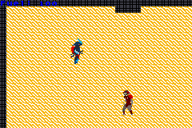

## Getting Started
in order to setup the dev environment make sure you have installed [DevkitPro](https://devkitpro.org/) specifically the GBA installation.
Also install [mGBA](https://mgba.io/) a usefull emulator for debugging under your C:\ path.

If you want to work in an environment identical to mine then you will need to install visual studio code and the following plugins: 
[Visual Studio ARM](https://marketplace.visualstudio.com/items?itemName=dan-c-underwood.arm)

[C/C++ plugin](https://marketplace.visualstudio.com/items?itemName=ms-vscode.cpptools)

[C/C++ Intellisense](https://marketplace.visualstudio.com/items?itemName=austin.code-gnu-global)

in your visual studio code go to prefferences/settings and under C/C++ change intellisense Mode to gcc
also under IntelliSense Engine change default to tag parser (theres a bug in intellisense that forces us to use this.)
You should then be able to open this repo under vs code. F5 to run debug.

## Special Thanks & Credits
for this project we're using a few other open source technologies:
[GBA Sprite Engine by Wouter Groeneveld](https://github.com/wgroeneveld/gba-sprite-engine)

[TONC: The best gba programming resource and fantastic library](https://www.coranac.com/projects/tonc/)

[And Jamie D Stewart's fantastic GBA game template](https://github.com/JamieDStewart/GBA_VSCode_Basic)

## Wait what even is this repo?
This project began as our UCSC final capstone project. Due to a lack of manpower and deadlines that did not take into account our unique project we decided to shelf the project for the time being.
Perhaps we will revisit this project in the future. GBA development was very interesting and incredibly challenging. Hopefully the GBA homebrew scene grows and more learning resources become available.
In the end we finished a tiny prototype that could fully work on GBA hardware :)

